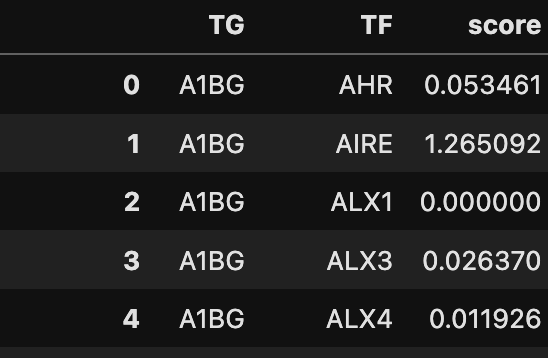
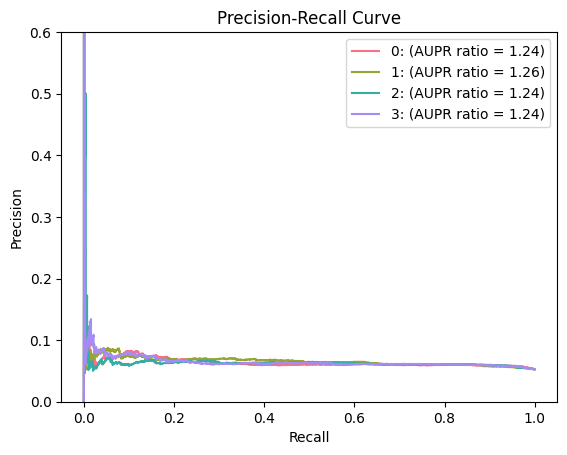

# Benchmark gene regulatory network
The example input we provided is an in-silico mixture of H1, BJ, GM12878, and K562 cell lines from SNARE-seq data. We benchmark the GRN of H1 cell line as example. 

## Download the groundtruth data
The groundtruth data is [Cistrome](http://cistrome.org/) putative target of TF from the ChIP-seq data. Here, we take the ChIP-seq data of E2F6 in H1 cell line as example. We download the ground truth on Cistrome as following (46177_gene_score_5fold.txt).
<div style="text-align: right">
  
</div>
## Prepare GRN file
You can provide a list of predicted GRN file. We support 2 format:
- list: There are 3 columns, Target gene (TG), TF, and regulation strength (score)
<div style="text-align: right">
  
</div>
- matrix: The row is gene name the column is TF name and the value is regulation strength. 

Here, we give 4 cell type specific GRN files as examples (the format here is 'matrix' described above).

## Roc and pr curve
```python
outdir='/zfs/durenlab/palmetto/Kaya/SC_NET/code/github/combine/LINGER/examples/output/'
TFName = 'E2F6'
Method_name=['0','1','2','3']
outdir=
Infer_trans=[outdir+'cell_type_specific_trans_regulatory_0.txt',outdir+'cell_type_specific_trans_regulatory_1.txt',outdir+'cell_type_specific_trans_regulatory_2.txt',outdir+'cell_type_specific_trans_regulatory_3.txt']

Groundtruth='/zfs/durenlab/palmetto/Kaya/SC_NET/code/github/combine/data/groundtruth/46177_gene_score_5fold.txt'
from LingerGRN import Benchmk
Benchmk.bm_trans(TFName,Method_name,Groundtruth,Infer_trans,outdir,'matrix')
```
<div style="text-align: right">
  
</div>
<div style="text-align: right">
  
</div>

The result will be automatically saved in the outdir with name trans_roc_curve+TFName+.pdf and trans_roc_curve+TFName+.pdf.
