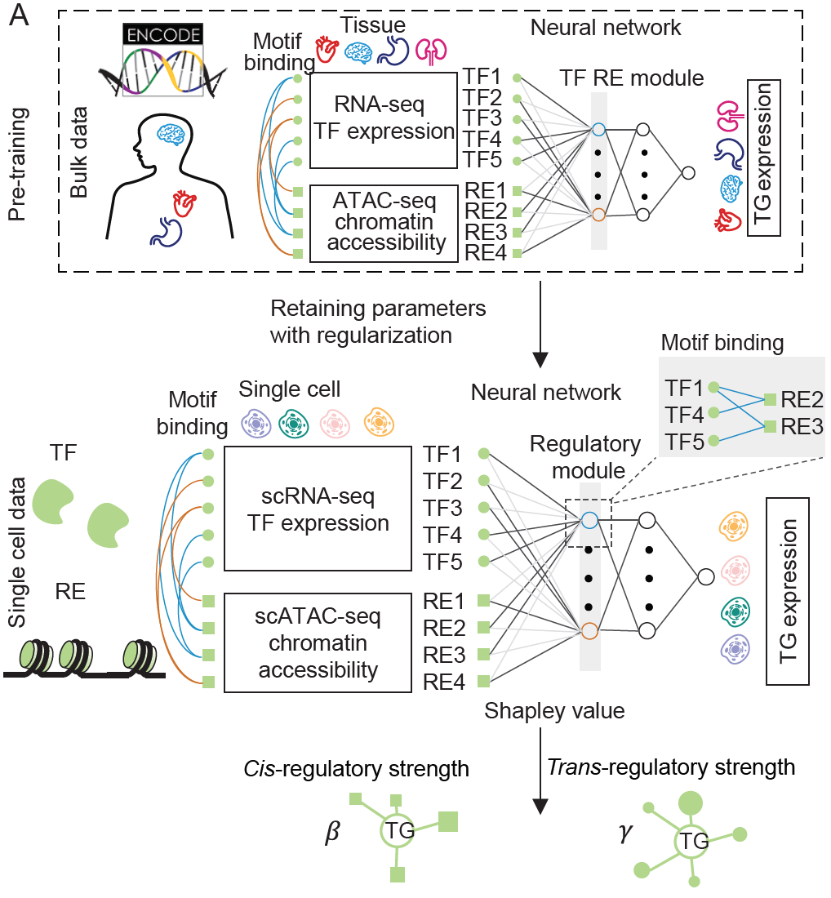
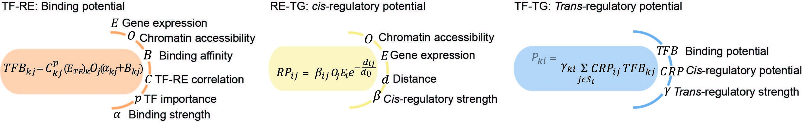
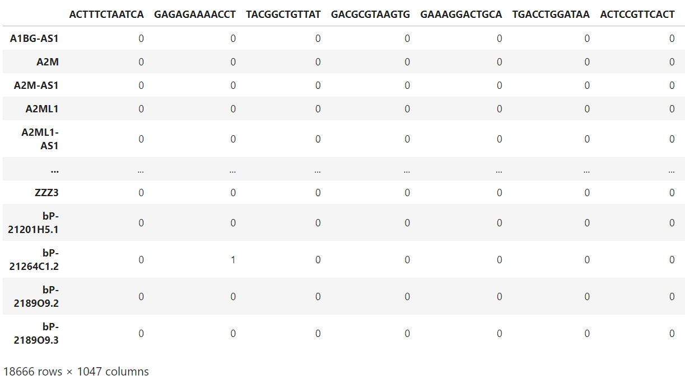
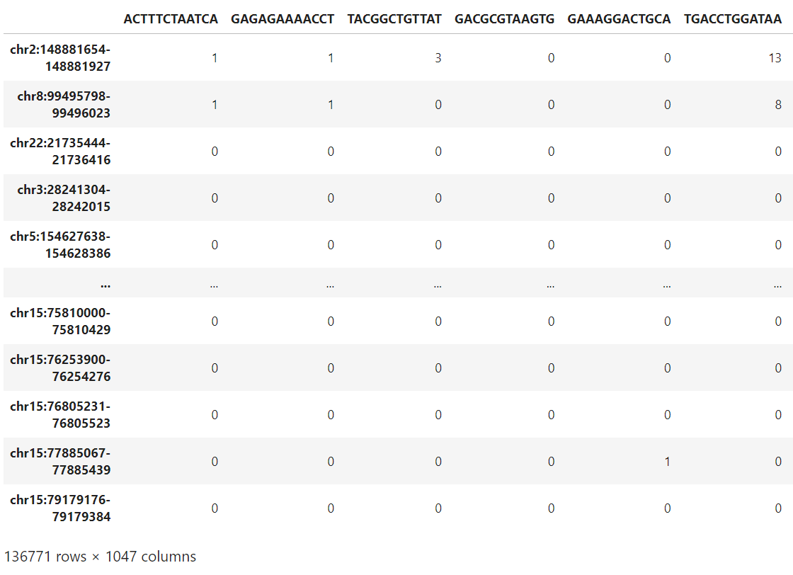
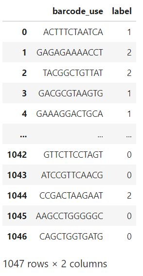

# Construct the gene regulatory network
## Instruction
This tutorial delineates an computational framework for constructing gene regulatory networks (GRNs) from single-cell multiome data. We provide 2 options to do this: '**baseline**' and '**LINGER**'. The first is a naive method combining the prior GRNs and features from the single-cell data, offering a rapid approach. LINGER integrates the comprehensive gene regulatory profile from external bulk data. As the following figure, LINGER use a lifelong machine learning (continuous learning) based on neural network (NN) models, which has been proven to leverage the knowledge learned in previous tasks to help learn the new task better.
<div style="text-align: right">
  
</div>

Afer constructing the GRNs for cell population, we infer the cell type specific one using the feature engineering approach. Just as the following figure, we combine the single cell data ($O, E$, and $C$ in the figure) and the prior gene regulatory network structure with the parameter $\alpha,\beta,d,B$, and $\gamma$.



## Download the the general gene regulatory network 
We provide the general gene regulatory network, please download the data first.
```sh
Datadir=/path/to/LINGER/# the directory to store the data please use the absolute directory. Example: Datadir=/zfs/durenlab/palmetto/Kaya/SC_NET/code/github/combine/data/
mkdir $Datadir
cd $Datadir
wget --load-cookies /tmp/cookies.txt "https://docs.google.com/uc?export=download&confirm=$(wget --quiet --save-cookies /tmp/cookies.txt --keep-session-cookies --no-check-certificate 'https://docs.google.com/uc?export=download&id=1lAlzjU5BYbpbr4RHMlAGDOh9KWdCMQpS' -O- | sed -rn 's/.*confirm=([0-9A-Za-z_]+).*/\1\n/p')&id=1lAlzjU5BYbpbr4RHMlAGDOh9KWdCMQpS" -O data_bulk.tar.gz && rm -rf /tmp/cookies.txt
```
Then unzip，
```sh
tar -xzf data_bulk.tar.gz
```

## Prepare the input data
The input data should be in same directory (Input_dir in this tutorial), which includes: 
- Single-cell multiome data including gene expression (RNA.txt in our example) and chromatin accessibility (ATAC.txt in our example).
- Cell annotation/cell type label if you need the cell type specific gene regulatory network (label.txt in our example).

### RNA-seq
The row of RNA-seq is gene symbol; the column is barcode; the value is the count matrix. Here is our example:
<div style="text-align: right">
  
</div>

### ATAC-seq
The row is regulatory element/genomic region; the column is barcode, which is the same order with RNA-seq data; the value is the count matrix. Here is our example:
<div style="text-align: right">
  
</div>

### Cell annotation/cell type label
The row is cell barcode, which is the same order with RNA-seq data; there is one column 'Annotation', which is the cell type label. It could be a number or the string. Here is our example:
<div style="text-align: right">
  
</div>

### Provided input example 
You can download the example input datasets into a certain directory. This sc multiome data of an in-silico mixture of H1, BJ, GM12878, and K562 cell lines from droplet-based single-nucleus chromatin accessibility and mRNA expression sequencing (SNARE-seq) data.

```sh
Input_dir=/path/to/dir/
# The input data directory. Example: Input_dir=/zfs/durenlab/palmetto/Kaya/SC_NET/code/github/combine/LINGER/examples/
cd $Input_dir
#ATAC-seq
wget --load-cookies /tmp/cookies.txt "https://docs.google.com/uc?export=download&confirm=$(wget --quiet --save-cookies /tmp/cookies.txt --keep-session-cookies --no-check-certificate 'https://docs.google.com/uc?export=download&id=1qmMudeixeRbYS8LCDJEuWxlAgeM0hC1r' -O- | sed -rn 's/.*confirm=([0-9A-Za-z_]+).*/\1\n/p')&id=1qmMudeixeRbYS8LCDJEuWxlAgeM0hC1r" -O ATAC.txt && rm -rf /tmp/cookies.txt
#RNA-seq
wget --load-cookies /tmp/cookies.txt "https://docs.google.com/uc?export=download&confirm=$(wget --quiet --save-cookies /tmp/cookies.txt --keep-session-cookies --no-check-certificate 'https://docs.google.com/uc?export=download&id=1dP4ITjQZiVDa52xfDTo5c14f9H0MsEGK' -O- | sed -rn 's/.*confirm=([0-9A-Za-z_]+).*/\1\n/p')&id=1dP4ITjQZiVDa52xfDTo5c14f9H0MsEGK" -O RNA.txt && rm -rf /tmp/cookies.txt
#label
wget --load-cookies /tmp/cookies.txt "https://docs.google.com/uc?export=download&confirm=$(wget --quiet --save-cookies /tmp/cookies.txt --keep-session-cookies --no-check-certificate 'https://docs.google.com/uc?export=download&id=1ZeEp5GnWfQJxuAY0uK9o8s_uAvFsNPI5' -O- | sed -rn 's/.*confirm=([0-9A-Za-z_]+).*/\1\n/p')&id=1ZeEp5GnWfQJxuAY0uK9o8s_uAvFsNPI5" -O label.txt && rm -rf /tmp/cookies.txt
```
## LINGER 
### Install
```sh
conda create -n LINGER python
conda activate LINGER
pip install LingerGRN
```
### Preprocess
There are 2 options of method we introduced above:
1. baseline;
```python
method='baseline'
```
2. LINGER;
```python
method='LINGER'
```
Map the regions to the given regions by running the following code in python. 
```python
RNA_file='RNA.txt'
ATAC_file='ATAC.txt'
label_file='label.txt'
Datadir='/zfs/durenlab/palmetto/Kaya/SC_NET/code/github/combine/data/'# this directory should be the same with Datadir
GRNdir=Datadir+'data_bulk/'
Input_dir= '/zfs/durenlab/palmetto/Kaya/SC_NET/code/github/combine/LINGER/examples/'# input data dir
genome='hg38'
outdir='/zfs/durenlab/palmetto/Kaya/SC_NET/code/github/combine/LINGER/examples/output/' #output dir
from LingerGRN.preprocess import *
preprocess(RNA_file,ATAC_file,label_file,Input_dir,GRNdir,genome,method,outdir)
```

### Training model
```python
import LingerGRN.LINGER_tr as LINGER_tr
LINGER_tr.training(GRNdir,Input_dir,method,outdir)
```

### Cell population gene regulatory network
#### TF binding potential
The output is 'cell_population_TF_RE_binding.txt', a matrix of the TF-RE binding score.
```python
import LingerGRN.LL_net as LL_net
LL_net.TF_RE_binding(Input_dir,GRNdir,RNA_file,ATAC_file,genome,method,outdir)
```

#### *cis*-regulatory network
The output is 'cell_population_cis_regulatory.txt' with 3 columns: region, target gene, cis-regulatory score.
```python
LL_net.cis_reg(Input_dir,GRNdir,RNA_file,ATAC_file,genome,method,outdir)
```
#### *trans*-regulatory network
The output is 'cell_population_trans_regulatory.txt', a matrix of the trans-regulatory score.
```python
LL_net.trans_reg(Input_dir,GRNdir,RNA_file,ATAC_file,method,outdir)
```

### Cell type sepecific gene regulaory network
There are 2 options:
1. infer GRN for a specific cell type, which is in the label.txt;
```python
celltype='0'#use a string to assign your cell type
```
2. infer GRNs for all cell types.
```python
celltype='all'
```
Please make sure that 'all' is not a cell type in your data.

#### TF binding potential
The output is 'cell_population_TF_RE_binding_*celltype*.txt', a matrix of the TF-RE binding potential.
```python
LL_net.cell_type_specific_TF_RE_binding(Input_dir,GRNdir,RNA_file,ATAC_file,label_file,genome,celltype,outdir)
```

#### *cis*-regulatory network
The output is 'cell_type_specific_cis_regulatory_{*celltype*}.txt' with 3 columns: region, target gene, cis-regulatory score.
```python
LL_net.cell_type_specific_cis_reg(Input_dir,GRNdir,RNA_file,ATAC_file,label_file,genome,celltype,outdir)
```

#### *trans*-regulatory network
The output is 'cell_type_specific_trans_regulatory_{*celltype*}.txt', a matrix of the trans-regulatory score.
```python
LL_net.cell_type_specific_trans_reg(Input_dir,GRNdir,RNA_file,label_file,ATAC_file,celltype,outdir)
```

## Note
- The cell specific GRN is based on the output of the cell population GRN.
- If we want to try 2 different method options, we can create 2 output directory.
