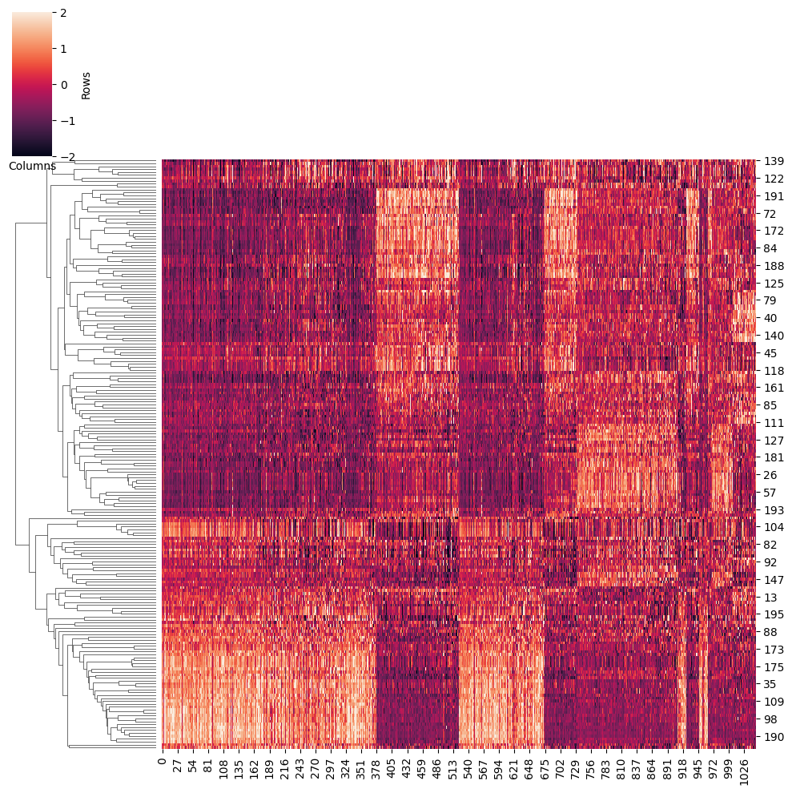

# Construct the gene regulatory network
# Load data
## Download the general gene regulatory network 
We provide the general gene regulatory network, please download the data first.
```sh
Datadir=/path/to/LINGER/# the directory to store the data please use the absolute directory. Example: Datadir=/zfs/durenlab/palmetto/Kaya/SC_NET/code/github/combine/data/
mkdir $Datadir
cd $Datadir
wget --load-cookies /tmp/cookies.txt "https://drive.usercontent.google.com/download?export=download&confirm=$(wget --quiet --save-cookies /tmp/cookies.txt --keep-session-cookies --no-check-certificate 'https://drive.usercontent.google.com/download?id=1lAlzjU5BYbpbr4RHMlAGDOh9KWdCMQpS'  -O- | sed -rn 's/.*confirm=([0-9A-Za-z_]+).*/\1\n/p')&id=1lAlzjU5BYbpbr4RHMlAGDOh9KWdCMQpS" -O data_bulk.tar.gz && rm -rf /tmp/cookies.txt
```
Then unzip，
```sh
tar -xzf data_bulk.tar.gz
```

## Input data
The input data should be anndata format. In this example, we need to transfer the following data type to anndata.
- Single-cell multiome data including gene expression (RNA.txt in our example) and chromatin accessibility (ATAC.txt in our example).
- Cell annotation/cell type label if you need the cell type specific gene regulatory network (label.txt in our example).
### RNA-seq
The row of RNA-seq is gene symbol; the column is the barcode; the value is the count matrix. Here is our example:
<div style="text-align: right">
  
</div>

### ATAC-seq
The row is the regulatory element/genomic region; the column is the barcode, which is in the same order as RNA-seq data; the value is the count matrix. Here is our example:
<div style="text-align: right">
  
</div>

### Cell annotation/cell type label
The row is cell barcode, which is the same order with RNA-seq data; there is one column 'Annotation', which is the cell type label. It could be a number or the string. Here is our example:
<div style="text-align: right">
  
</div>

### Provided input example 
You can download the example input datasets into a certain directory. This sc multiome data of an in-silico mixture of H1, BJ, GM12878, and K562 cell lines from droplet-based single-nucleus chromatin accessibility and mRNA expression sequencing (SNARE-seq) data.

```sh
Input_dir=/path/to/dir/
# The input data directory. Example: Input_dir=/zfs/durenlab/palmetto/Kaya/SC_NET/code/github/combine/LINGER/examples/
cd $Input_dir
#ATAC-seq
wget --load-cookies /tmp/cookies.txt "https://drive.usercontent.google.com/download?export=download&confirm=$(wget --quiet --save-cookies /tmp/cookies.txt --keep-session-cookies --no-check-certificate 'https://drive.usercontent.google.com/download?id=1qmMudeixeRbYS8LCDJEuWxlAgeM0hC1r'  -O- | sed -rn 's/.*confirm=([0-9A-Za-z_]+).*/\1\n/p')&id=1qmMudeixeRbYS8LCDJEuWxlAgeM0hC1r" -O ATAC.txt && rm -rf /tmp/cookies.txt
#RNA-seq
wget --load-cookies /tmp/cookies.txt "https://docs.google.com/uc?export=download&confirm=$(wget --quiet --save-cookies /tmp/cookies.txt --keep-session-cookies --no-check-certificate 'https://docs.google.com/uc?export=download&id=1dP4ITjQZiVDa52xfDTo5c14f9H0MsEGK' -O- | sed -rn 's/.*confirm=([0-9A-Za-z_]+).*/\1\n/p')&id=1dP4ITjQZiVDa52xfDTo5c14f9H0MsEGK" -O RNA.txt && rm -rf /tmp/cookies.txt
#label
wget --load-cookies /tmp/cookies.txt "https://docs.google.com/uc?export=download&confirm=$(wget --quiet --save-cookies /tmp/cookies.txt --keep-session-cookies --no-check-certificate 'https://docs.google.com/uc?export=download&id=1ZeEp5GnWfQJxuAY0uK9o8s_uAvFsNPI5' -O- | sed -rn 's/.*confirm=([0-9A-Za-z_]+).*/\1\n/p')&id=1ZeEp5GnWfQJxuAY0uK9o8s_uAvFsNPI5" -O label.txt && rm -rf /tmp/cookies.txt
```
## LINGER 
### Install
```sh
conda create -n LINGER python==3.10.0
conda activate LINGER
pip install LingerGRN==1.49
conda install bioconda::bedtools #Requirement
```
### Preprocess
There are 2 options of the method we introduced above:
1. baseline;
```python
method='baseline' # this is corresponding to bulkNN
```
2. LINGER;
```python
method='LINGER'
```
#### Tansfer sc-multiome data to anndata
```python
import pandas as pd
label=pd.read_csv('data/label.txt',sep='\t',header=0,index_col=None)
RNA=pd.read_csv('data/RNA.txt',sep='\t',header=0,index_col=0)
ATAC=pd.read_csv('data/ATAC.txt',sep='\t',header=0,index_col=0)
from scipy.sparse import csc_matrix
# Convert the NumPy array to a sparse csc_matrix
matrix = csc_matrix(pd.concat([RNA,ATAC],axis=0).values)
features=pd.DataFrame(RNA.index.tolist()+ATAC.index.tolist(),columns=[1])
K=RNA.shape[0]
N=K+ATAC.shape[0]
types = ['Gene Expression' if i <= K else 'Peaks' for i in range(0, N)]
features[2]=types
barcodes=pd.DataFrame(RNA.columns.values,columns=[0])
from LingerGRN.preprocess import *
adata_RNA,adata_ATAC=get_adata(matrix,features,barcodes,label)# adata_RNA and adata_ATAC are scRNA and scATAC
```
#### Remove low counts cells and genes 
```python
import scanpy as sc
sc.pp.filter_cells(adata_RNA, min_genes=200)
sc.pp.filter_genes(adata_RNA, min_cells=3)
sc.pp.filter_cells(adata_ATAC, min_genes=200)
sc.pp.filter_genes(adata_ATAC, min_cells=3)
selected_barcode=list(set(adata_RNA.obs['barcode'].values)&set(adata_ATAC.obs['barcode'].values))
barcode_idx=pd.DataFrame(range(adata_RNA.shape[0]), index=adata_RNA.obs['barcode'].values)
adata_RNA = adata_RNA[barcode_idx.loc[selected_barcode][0]]
adata_ATAC = adata_ATAC[barcode_idx.loc[selected_barcode][0]]
```
#### Generate the pseudo-bulk/metacell
```python
from pseudo_bulk import *
adata_RNA,adata_ATAC=find_neighbors(adata_RNA,adata_ATAC)
samplelist=list(set(adata_ATAC.obs['sample'].values)) # sample is generated from cell barcode 
tempsample=samplelist[0]
TG_pseudobulk=pd.DataFrame([])
RE_pseudobulk=pd.DataFrame([])
for tempsample in samplelist:
    TG_pseudobulk_temp,RE_pseudobulk_temp=pseudo_bulk(adata_RNA[adata_RNA.obs['sample']==tempsample],adata_ATAC[adata_ATAC.obs['sample']==tempsample])                
    TG_pseudobulk=pd.concat([TG_pseudobulk, TG_pseudobulk_temp], axis=1)
    RE_pseudobulk=pd.concat([RE_pseudobulk, RE_pseudobulk_temp], axis=1)
    RE_pseudobulk[RE_pseudobulk > 100] = 100

adata_ATAC.write('data/adata_ATAC.h5ad')
adata_RNA.write('data/adata_RNA.h5ad')
adata_ATAC.raw.var['gene_ids'].to_csv('data/Peaks.txt',header=None,index=None)
TG_pseudobulk.to_csv('data/TG_pseudobulk.tsv')
RE_pseudobulk.to_csv('data/RE_pseudobulk.tsv')
```
### Training model
Overlap the region with general GRN:
```python
from LingerGRN.preprocess import *
Datadir='/path/to/LINGER/'# This directory should be the same as Datadir defined in the above 'Download the general gene regulatory network' section
GRNdir=Datadir+'data_bulk/'
genome='hg38'
outdir='/path/to/output/' #output dir
preprocess(TG_pseudobulk,RE_pseudobulk,GRNdir,genome,method,outdir)
```
Train for the LINGER model.
```python
import LingerGRN.LINGER_tr as LINGER_tr
activef='ReLU' # active function chose from 'ReLU','sigmoid','tanh'
LINGER_tr.training(GRNdir,method,outdir,activef)
```
### Cell population gene regulatory network
#### TF binding potential
The output is 'cell_population_TF_RE_binding.txt', a matrix of the TF-RE binding score.
```python
import LingerGRN.LL_net as LL_net
LL_net.TF_RE_binding(GRNdir,adata_RNA,adata_ATAC,genome,method,outdir)
```

#### *cis*-regulatory network
The output is 'cell_population_cis_regulatory.txt' with 3 columns: region, target gene, cis-regulatory score.
```python
LL_net.cis_reg(GRNdir,adata_RNA,adata_ATAC,genome,method,outdir)
```
#### *trans*-regulatory network
The output is 'cell_population_trans_regulatory.txt', a matrix of the trans-regulatory score.
```python
LL_net.trans_reg(GRNdir,method,outdir)
```

### Cell type sepecific gene regulaory network
There are 2 options:
1. infer GRN for a specific cell type, which is in the label.txt;
```python
celltype='0'#use a string to assign your cell type
```
2. infer GRNs for all cell types.
```python
celltype='all'
```
Please make sure that 'all' is not a cell type in your data.

#### TF binding potential
The output is 'cell_population_TF_RE_binding_*celltype*.txt', a matrix of the TF-RE binding potential.
```python
LL_net.cell_type_specific_TF_RE_binding(GRNdir,adata_RNA,adata_ATAC,genome,celltype,outdir)
```

#### *cis*-regulatory network
The output is 'cell_type_specific_cis_regulatory_{*celltype*}.txt' with 3 columns: region, target gene, cis-regulatory score.
```python
LL_net.cell_type_specific_cis_reg(GRNdir,adata_RNA,adata_ATAC,genome,celltype,outdir)
```

#### *trans*-regulatory network
The output is 'cell_type_specific_trans_regulatory_{*celltype*}.txt', a matrix of the trans-regulatory score.
```python
LL_net.cell_type_specific_trans_reg(GRNdir,adata_RNA,celltype,outdir)
```

## Note
- The cell specific GRN is based on the output of the cell population GRN.
- If we want to try 2 different method options, we can create 2 output directory.
## Identify driver regulators by TF activity
### Instruction
TF activity, focusing on the DNA-binding component of TF proteins in the nucleus, is a more reliable metric than mRNA or whole protein expression for identifying driver regulators. Here, we employed LINGER inferred GRNs from sc-multiome data of a single individual. Assuming the GRN structure is consistent across individuals, we estimated TF activity using gene expression data alone. By comparing TF activity between cases and controls, we identified driver regulators. 

### Prepare
We need to *trans*-regulatory network, you can choose a network match you data best.
1. If there is not single cell avaliable to infer the cell population and cell type specific GRN, you can choose a GRN from various tissues.
```python
network = 'general'
```
2. If your gene expression data are matched with cell population GRN, you can set
```python
network = 'cell population'
```
3. If your gene expression data are matched with certain cell type, you can set network to the name of this cell type.
```python
network = '0' # 0 is the name of one cell type
```

### Calculate TF activity
The input is gene expression data, It could be the scRNA-seq data from the sc multiome data. It could be other sc or bulk RNA-seq data matches the GRN. The row of gene expresion data is gene, columns is sample and the value is read count (sc) or FPKM/RPKM (bulk).

```python
Datadir='/zfs/durenlab/palmetto/Kaya/SC_NET/code/github/combine/'# this directory should be the same with Datadir
GRNdir=Datadir+'data_bulk/'
genome='hg38'
from LingerGRN.TF_activity import *
outdir='/zfs/durenlab/palmetto/Kaya/SC_NET/code/github/combine/LINGER/examples/output/' #output dir
import anndata
adata_RNA=anndata.read_h5ad('data/adata_RNA.h5ad')
TF_activity=regulon(outdir,adata_RNA,GRNdir,network,genome)
```
Visualize the TF activity heatmap by cluster. If you want to save the heatmap to outdit, please set 'save=True'. The output is 'heatmap_activity.png'.
```python
save=True
heatmap_cluster(TF_activity,adata_RNA,save,outdir)
```
<div style="text-align: right">
  
</div>

### Identify driver regulator
We use t-test to find the differential TFs of a certain cell type by the activity. 
1. You can assign a certain cell type of the gene expression data by
```python
celltype='0'
```
2. Or, you can obtain the result for all cell types.
```python
celltype='all'
```

For example,

```python
celltype='0'
t_test_results=master_regulator(TF_activity,adata_RNA,celltype)
t_test_results
```

<div style="text-align: right">
  
</div>

Visulize the differential activity and expression. You can compare 2 different cell types and one cell type with other cell types. If you want to save the heatmap to outdit, please set 'save=True'. The output is 'box_plot'_+TFName+'_'+datatype+'_'+celltype1+'_'+celltype2+'.png'.

```python
TFName='ATF1'
datatype='activity'
celltype1='0'
celltype2='Others'
save=True
box_comp(TFName,adata_RNA,celltype1,celltype2,datatype,regulon_score,save,outdir)
```

<div style="text-align: right">
  
</div>

For gene expression data, the boxplot is:
```python
datatype='expression'
box_comp(TFName,adata_RNA,celltype1,celltype2,datatype,regulon_score,save,outdir)
```

<div style="text-align: right">
  
</div>
