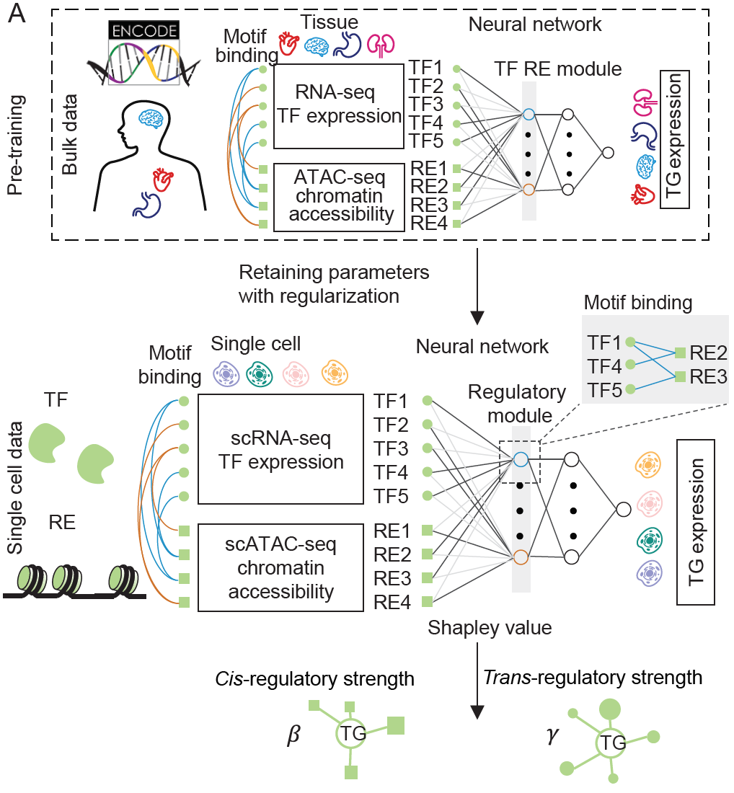

# PBMCs Tutorial
## Instruction
This tutorial delineates a computational framework for constructing gene regulatory networks (GRNs) from single-cell multiome data. We provide 2 options to do this: '**baseline**' and '**LINGER**'. The first is a naive method combining the prior GRNs and features from the single-cell data, offering a rapid approach. LINGER integrates the comprehensive gene regulatory profile from external bulk data. As the following figure, LINGER uses lifelong machine learning (continuous learning) based on neural network (NN) models, which has been proven to leverage the knowledge learned in previous tasks to help learn the new task better.
<div style="text-align: right">
  
</div>

After constructing the GRNs for the cell population, we infer the cell type specific one using the feature engineering approach. Just as in the following figure, we combine the single cell data ($O, E$, and $C$ in the figure) and the prior gene regulatory network structure with the parameter $\alpha,\beta,d,B$, and $\gamma$.


## Download the general gene regulatory network 
We provide the general gene regulatory network, please download the data first.
```sh
Datadir=/path/to/LINGER/# the directory to store the data please use the absolute directory. Example: Datadir=/zfs/durenlab/palmetto/Kaya/SC_NET/code/github/combine/data/
mkdir $Datadir
cd $Datadir
wget --load-cookies /tmp/cookies.txt "https://drive.usercontent.google.com/download?export=download&confirm=$(wget --quiet --save-cookies /tmp/cookies.txt --keep-session-cookies --no-check-certificate 'https://drive.usercontent.google.com/download?id=1lAlzjU5BYbpbr4RHMlAGDOh9KWdCMQpS'  -O- | sed -rn 's/.*confirm=([0-9A-Za-z_]+).*/\1\n/p')&id=1lAlzjU5BYbpbr4RHMlAGDOh9KWdCMQpS" -O data_bulk.tar.gz && rm -rf /tmp/cookies.txt
```
or use the following link: [https://drive.google.com/file/d/1lAlzjU5BYbpbr4RHMlAGDOh9KWdCMQpS/view?usp=sharing](https://drive.google.com/file/d/1lAlzjU5BYbpbr4RHMlAGDOh9KWdCMQpS/view?usp=sharing)

Then unzip，
```sh
tar -xzf data_bulk.tar.gz
```

## Prepare the input data
The input data is the feature matrix from 10x sc-multiome data and Cell annotation/cell type label which includes: 
- Single-cell multiome data including matrix.mtx.gz, features.tsv.gz, and barcodes.tsv.gz.
- Cell annotation/cell type label if you need the cell type-specific gene regulatory network (PBMC_label.txt in our example).
<div style="text-align: right">
  
</div>  

If the input data is 10X h5 file or h5ad file from scanpy, please follow the instruction [h5/h5ad file as input](https://github.com/Durenlab/LINGER/blob/main/docs/h5_input.md) .

### sc data
We download the data using shell command line.
```sh
mkdir -p data
wget -O data/pbmc_granulocyte_sorted_10k_filtered_feature_bc_matrix.tar.gz https://cf.10xgenomics.com/samples/cell-arc/2.0.0/pbmc_granulocyte_sorted_10k/pbmc_granulocyte_sorted_10k_filtered_feature_bc_matrix.tar.gz
tar -xzvf data/pbmc_granulocyte_sorted_10k_filtered_feature_bc_matrix.tar.gz
mv filtered_feature_bc_matrix data/
gzip -d data/filtered_feature_bc_matrix/*
```
We provide the cell annotation as following:
```sh
wget --load-cookies /tmp/cookies.txt "https://docs.google.com/uc?export=download&confirm=$(wget --quiet --save-cookies /tmp/cookies.txt --keep-session-cookies --no-check-certificate 'https://docs.google.com/uc?export=download&id=17PXkQJr8fk0h90dCkTi3RGPmFNtDqHO_' -O- | sed -rn 's/.*confirm=([0-9A-Za-z_]+).*/\1\n/p')&id=17PXkQJr8fk0h90dCkTi3RGPmFNtDqHO_" -O PBMC_label.txt && rm -rf /tmp/cookies.txt
mv PBMC_label.txt data/
```
## LINGER 
### Install
```sh
conda create -n LINGER python==3.10.0
conda activate LINGER
pip install LingerGRN==1.93
conda install bioconda::bedtools #Requirement
```
For the following step, we run the code in python.
### Preprocess
There are 2 options for the method we introduced above:
1. baseline;
```python
method='baseline' # this method is corresponding to bulkNN described in the paper
```
2. LINGER;
```python
method='LINGER'
```
#### Transfer the sc-multiome data to anndata  

We will transfer sc-multiome data to the anndata format and filter the cell barcode by the cell type label.
```python
import scanpy as sc
#set some figure parameters for nice display inside jupyternotebooks.
%matplotlib inline
sc.settings.set_figure_params(dpi=80, frameon=False, figsize=(5, 5), facecolor='white')
sc.settings.verbosity = 3  # verbosity: errors (0), warnings (1), info (2), hints (3)
sc.logging.print_header()
#results_file = "scRNA/pbmc10k.h5ad"
import scipy
import pandas as pd
matrix=scipy.io.mmread('data/filtered_feature_bc_matrix/matrix.mtx')
features=pd.read_csv('data/filtered_feature_bc_matrix/features.tsv',sep='\t',header=None)
barcodes=pd.read_csv('data/filtered_feature_bc_matrix/barcodes.tsv',sep='\t',header=None)
label=pd.read_csv('data/PBMC_label.txt',sep='\t',header=0)
from LingerGRN.preprocess import *
adata_RNA,adata_ATAC=get_adata(matrix,features,barcodes,label)# adata_RNA and adata_ATAC are scRNA and scATAC
```
#### Remove low counts cells and genes
```python
import scanpy as sc
sc.pp.filter_cells(adata_RNA, min_genes=200)
sc.pp.filter_genes(adata_RNA, min_cells=3)
sc.pp.filter_cells(adata_ATAC, min_genes=200)
sc.pp.filter_genes(adata_ATAC, min_cells=3)
selected_barcode=list(set(adata_RNA.obs['barcode'].values)&set(adata_ATAC.obs['barcode'].values))
barcode_idx=pd.DataFrame(range(adata_RNA.shape[0]), index=adata_RNA.obs['barcode'].values)
adata_RNA = adata_RNA[barcode_idx.loc[selected_barcode][0]]
barcode_idx=pd.DataFrame(range(adata_ATAC.shape[0]), index=adata_ATAC.obs['barcode'].values)
adata_ATAC = adata_ATAC[barcode_idx.loc[selected_barcode][0]]
```
#### Generate the pseudo-bulk/metacell:
```python
from LingerGRN.pseudo_bulk import *
samplelist=list(set(adata_ATAC.obs['sample'].values)) # sample is generated from cell barcode 
tempsample=samplelist[0]
TG_pseudobulk=pd.DataFrame([])
RE_pseudobulk=pd.DataFrame([])
singlepseudobulk = (adata_RNA.obs['sample'].unique().shape[0]*adata_RNA.obs['sample'].unique().shape[0]>100)
for tempsample in samplelist:
    adata_RNAtemp=adata_RNA[adata_RNA.obs['sample']==tempsample]
    adata_ATACtemp=adata_ATAC[adata_ATAC.obs['sample']==tempsample]
    TG_pseudobulk_temp,RE_pseudobulk_temp=pseudo_bulk(adata_RNAtemp,adata_ATACtemp,singlepseudobulk)                
    TG_pseudobulk=pd.concat([TG_pseudobulk, TG_pseudobulk_temp], axis=1)
    RE_pseudobulk=pd.concat([RE_pseudobulk, RE_pseudobulk_temp], axis=1)
    RE_pseudobulk[RE_pseudobulk > 100] = 100

import os
if not os.path.exists('data/'):
    os.mkdir('data/')
adata_ATAC.write('data/adata_ATAC.h5ad')
adata_RNA.write('data/adata_RNA.h5ad')
TG_pseudobulk=TG_pseudobulk.fillna(0)
RE_pseudobulk=RE_pseudobulk.fillna(0)
pd.DataFrame(adata_ATAC.var['gene_ids']).to_csv('data/Peaks.txt',header=None,index=None)
TG_pseudobulk.to_csv('data/TG_pseudobulk.tsv')
RE_pseudobulk.to_csv('data/RE_pseudobulk.tsv')
```
### Training model
Overlap the region with general GRN:
```python
from LingerGRN.preprocess import *
Datadir='/path/to/LINGER/'# This directory should be the same as Datadir defined in the above 'Download the general gene regulatory network' section
GRNdir=Datadir+'data_bulk/'
genome='hg38'
outdir='/path/to/output/' #output dir
preprocess(TG_pseudobulk,RE_pseudobulk,GRNdir,genome,method,outdir)
```
Train for the LINGER model.
```python
import LingerGRN.LINGER_tr as LINGER_tr
activef='ReLU' # active function chose from 'ReLU','sigmoid','tanh'
LINGER_tr.training(GRNdir,method,outdir,activef,'Human')
```


### Cell population gene regulatory network
#### TF binding potential
The output is 'cell_population_TF_RE_binding.txt', a matrix of the TF-RE binding score.
```python
import LingerGRN.LL_net as LL_net
LL_net.TF_RE_binding(GRNdir,adata_RNA,adata_ATAC,genome,method,outdir)
```

#### *cis*-regulatory network
The output is 'cell_population_cis_regulatory.txt' with 3 columns: region, target gene, cis-regulatory score.
```python
LL_net.cis_reg(GRNdir,adata_RNA,adata_ATAC,genome,method,outdir)
```
#### *trans*-regulatory network
The output is 'cell_population_trans_regulatory.txt', a matrix of the trans-regulatory score.
```python
LL_net.trans_reg(GRNdir,method,outdir)
```

### Cell type sepecific gene regulaory network
There are 2 options:
1. infer GRN for a specific cell type, which is in the label.txt;
```python
celltype='CD56 (bright) NK cells' #use a string to assign your cell type
```
2. infer GRNs for all cell types.
```python
celltype='all'
```
Please make sure that 'all' is not a cell type in your data.

#### TF binding potential
The output is 'cell_population_TF_RE_binding_*celltype*.txt', a matrix of the TF-RE binding potential.
```python
LL_net.cell_type_specific_TF_RE_binding(GRNdir,adata_RNA,adata_ATAC,genome,celltype,outdir,method)# different from the previous version
```

#### *cis*-regulatory network
The output is 'cell_type_specific_cis_regulatory_{*celltype*}.txt' with 3 columns: region, target gene, cis-regulatory score.
```python
LL_net.cell_type_specific_cis_reg(GRNdir,adata_RNA,adata_ATAC,genome,celltype,outdir)
```

#### *trans*-regulatory network
The output is 'cell_type_specific_trans_regulatory_{*celltype*}.txt', a matrix of the trans-regulatory score.
```python
LL_net.cell_type_specific_trans_reg(GRNdir,adata_RNA,celltype,outdir)
```
## Identify driver regulators by TF activity
### Instruction
TF activity, focusing on the DNA-binding component of TF proteins in the nucleus, is a more reliable metric than mRNA or whole protein expression for identifying driver regulators. Here, we employed LINGER inferred GRNs from sc-multiome data of a single individual. Assuming the GRN structure is consistent across individuals, we estimated TF activity using gene expression data alone. By comparing TF activity between cases and controls, we identified driver regulators. 

### Prepare
We need to *trans*-regulatory network, you can choose a network match you data best.
1. If there is not single cell avaliable to infer the cell population and cell type specific GRN, you can choose a GRN from various tissues.
```python
network = 'general'
```
2. If your gene expression data are matched with cell population GRN, you can set
```python
network = 'cell population'
```
3. If your gene expression data are matched with certain cell type, you can set network to the name of this cell type.
```python
network = 'CD56 (bright) NK cells' # CD56 (bright) NK cells is the name of one cell type
```

### Calculate TF activity
The input is gene expression data, It could be the scRNA-seq data from the sc multiome data. It could be other sc or bulk RNA-seq data matches the GRN. The row of gene expresion data is gene, columns is sample and the value is read count (sc) or FPKM/RPKM (bulk).

```python

Datadir='/zfs/durenlab/palmetto/Kaya/SC_NET/code/github/combine/'# this directory should be the same with Datadir
GRNdir=Datadir+'data_bulk/'
genome='hg38'
from LingerGRN.TF_activity import *
outdir='/zfs/durenlab/palmetto/Kaya/SC_NET/code/github/combine/LINGER/examples/output/' #output dir
import anndata
adata_RNA=anndata.read_h5ad('data/adata_RNA.h5ad')
TF_activity=regulon(outdir,adata_RNA,GRNdir,network,genome)
```
Visualize the TF activity heatmap by cluster. If you want to save the heatmap to outdit, please set 'save=True'. The output is 'heatmap_activity.png'.
```python
save=True
heatmap_cluster(TF_activity,adata_RNA,save,outdir)
```
<div style="text-align: right">
  
</div>

### Identify driver regulator
We use t-test to find the differential TFs of a certain cell type by the activity. 
1. You can assign a certain cell type of the gene expression data by
```python
celltype='CD56 (bright) NK cells'
```
2. Or, you can obtain the result for all cell types.
```python
celltype='all'
```

For example,

```python
celltype='CD56 (bright) NK cells'
t_test_results=master_regulator(TF_activity,adata_RNA,celltype)
t_test_results
```

<div style="text-align: right">
  
</div>

Visulize the differential activity and expression. You can compare 2 different cell types and one cell type with other cell types. If you want to save the heatmap to outdit, please set 'save=True'. The output is 'box_plot'_+TFName+'_'+datatype+'_'+celltype1+'_'+celltype2+'.png'.

```python
TFName='ATF1'
datatype='activity'
celltype1='CD56 (bright) NK cells'
celltype2='Others'
save=True
box_comp(TFName,adata_RNA,celltype1,celltype2,datatype,regulon_score,save,outdir)
```

<div style="text-align: right">
  
</div>

For gene expression data, the boxplot is:
```python
datatype='expression'
box_comp(TFName,adata_RNA,celltype1,celltype2,datatype,TF_activity,save,outdir)
```

<div style="text-align: right">
  
</div>

## Note
- The cell specific GRN is based on the output of the cell population GRN.
- If we want to try 2 different method options, we can create 2 output directory.


