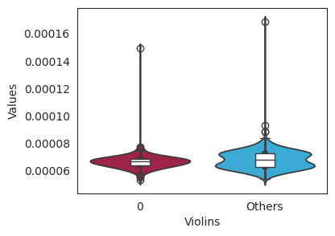
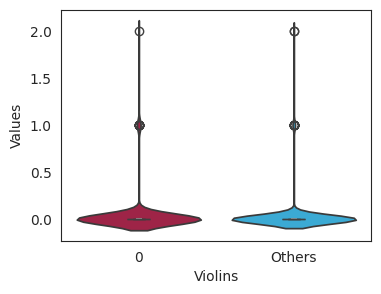

# Identify driver regulators by TF activity
## Instruction
TF activity, focusing on the DNA-binding component of TF proteins in the nucleus, is a more reliable metric than mRNA or whole protein expression for identifying driver regulators. Here, we employed LINGER inferred GRNs from sc-multiome data of a single individual. Assuming the GRN structure is consistent across individuals, we estimated TF activity using gene expression data alone. By comparing TF activity between cases and controls, we identified driver regulators. 

## Prepare
We need to *trans*-regulatory network, you can choose a network match you data best.
1. If there is not single cell avaliable to infer the cell population and cell type specific GRN, you can choose a GRN from various tissues.
```python
network = 'general'
```
2. If your gene expression data are matched with cell population GRN, you can set
```python
network = 'cell population'
```
3. If your gene expression data are matched with certain cell type, you can set network to the name of this cell type.
```python
network = '0' # 0 is the name of one cell type
```

## Calculate TF activity
The input is gene expression data, It could be the scRNA-seq data from the sc multiome data. It could be other sc or bulk RNA-seq data matches the GRN. The row of gene expresion data is gene, columns is sample and the value is read count (sc) or FPKM/RPKM (bulk).

```python

Datadir='/zfs/durenlab/palmetto/Kaya/SC_NET/code/github/combine/'# this directory should be the same with Datadir
GRNdir=Datadir+'data_bulk/'
genome='hg38'
from LingerGRN.TF_activity import *
outdir='/zfs/durenlab/palmetto/Kaya/SC_NET/code/github/combine/LINGER/examples/output/' #output dir
import anndata
adata_RNA=anndata.read_h5ad('data/adata_RNA.h5ad')
TF_activity=regulon(outdir,adata_RNA,GRNdir,network,genome)
```
Visualize the TF activity heatmap by cluster. If you want to save the heatmap to outdit, please set 'save=True'. The output is 'heatmap_activity.png'.
```python
save=True
heatmap_cluster(TF_activity,adata_RNA,save,outdir)
```
<div style="text-align: right">
  
</div>

## Identify driver regulator
We use t-test to find the differential TFs of a certain cell type by the activity. 
1. You can assign a certain cell type of the gene expression data by
```python
celltype='0'
```
2. Or, you can obtain the result for all cell types.
```python
celltype='all'
```

For example,

```python
celltype='0'
t_test_results=master_regulator(TF_activity,adata_RNA,celltype)
t_test_results
```

<div style="text-align: right">
  
</div>

Visulize the differential activity and expression. You can compare 2 different cell types and one cell type with other cell types. If you want to save the heatmap to outdit, please set 'save=True'. The output is 'box_plot'_+TFName+'_'+datatype+'_'+celltype1+'_'+celltype2+'.png'.

```python
TFName='ATF1'
datatype='activity'
celltype1='0'
celltype2='Others'
save=True
box_comp(TFName,labels,celltype1,celltype2,datatype,RNA_file,TF_activity,save,outdir)
```

<div style="text-align: right">
  
</div>

For gene expression data, the boxplot is:
```python
datatype='expression'
box_comp(TFName,labels,celltype1,celltype2,datatype,RNA_file,TF_activity,save,outdir)
```

<div style="text-align: right">
  
</div>
