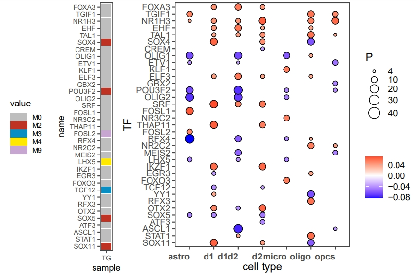

# Downstream analysis- TF driver score
## Driver Score
We identify driver TFs underlying epigenetic and transcriptomics change between control and AUD using a correlation model. We normalized the GRN and then calculated the Pearson Correlation Coefficient (PCC) between expression or chromatin accessibility fold change and the regulatory strength of TGs or REs for each TF.
### Request
Please complete the following the following tutorials 
- PBMC [https://github.com/Durenlab/LINGER/blob/main/docs/downstream.md]
-
### Transcriptomics driver score
```python
import pandas as pd
TG_pseudobulk = pd.read_csv('data/TG_pseudobulk.tsv',sep=',',header=0,index_col=0)
TG_pseudobulk = TG_pseudobulk[~TG_pseudobulk.index.str.startswith('MT-')] # remove the mitochondrion, if the species is mouse, replace 'MT-' with 'mt-'
import scanpy as sc
adata_RNA = sc.read_h5ad('data/adata_RNA.h5ad')
label_all = adata_RNA.obs[['barcode','sample','label']]
label_all.index = label_all['barcode']
metadata = label_all.loc[TG_pseudobulk.columns]
metadata.columns = ['barcode','group','celltype']
GRN='trans_regulatory'
adjust_method='bonferroni' 
corr_method='pearsonr'
import numpy as np
C_result_RNA_sp,P_result_RNA_sp,Q_result_RNA_sp=driver_score(TG_pseudobulk,metadata,GRN,outdir,adjust_method,corr_method)
K=3 # We choose the top K positive and negative TFs to save to the txt file for visualization purposes.
C_result_RNA_sp_r,Q_result_RNA_sp_r=driver_result(C_result_RNA_sp,Q_result_RNA_sp,K)
C_result_RNA_sp_r.to_csv('C_result_RNA_sp_r.txt',sep='\t')
Q_result_RNA_sp_r.to_csv('Q_result_RNA_sp_r.txt',sep='\t')
```
The adjust_method is the p-value adjust method, you could choose one from the following:
- bonferroni : one-step correction
- sidak : one-step correction
- holm-sidak : step down method using Sidak adjustments
- holm : step-down method using Bonferroni adjustments
- simes-hochberg : step-up method (independent)
- hommel : closed method based on Simes tests (non-negative)
- fdr_bh : Benjamini/Hochberg (non-negative)
- fdr_by : Benjamini/Yekutieli (negative)
- fdr_tsbh : two stage fdr correction (non-negative)
- fdr_tsbky : two stage fdr correction (non-negative)
### visualize
```python
import os
os.environ['R_HOME'] = '/data2/duren_lab/Kaya/conda_envs/LINGER/lib/R'  # Replace with your actual R home path
import rpy2.robjects as robjects
from rpy2.robjects import r
# Import the R plotting package (ggplot2 as an example)
r('library(ggplot2)')
r('library(grid)')
# Create data in R environment through Python
r('''
dataP=read.table('Q_result_RNA_sp_r.txt',sep='\t',row.names=1,header=TRUE)
dataT=read.table('C_result_RNA_sp_r.txt',sep='\t',row.names=1,header=TRUE)
sort_TF=rownames(dataT)
library(tidyr)
dataP=-log10(dataP)
print(paste0('maxinum of -log10P:',max(dataP)))
dataP[dataP>40]=40
dataP1=dataP
dataP1$TF=rownames(dataP)
longdiff0 <- gather(dataP1, sample, value,-TF)
longdiff0_s <- longdiff0[order(longdiff0$TF, longdiff0$sample), ]
dataT1=dataT
dataT1$TF=rownames(dataT)
longdiff1=gather(dataT1, sample, value,-TF)
longdiff1=longdiff1[order(longdiff1$TF, longdiff1$sample), ]
colnames(longdiff1)=c('TF','celltype','PCC')
longdiff1$P=longdiff0_s$value
longdiff1$TF=factor(longdiff1$TF,levels=rev(sort_TF))
library(egg)
limits0=c(2,ceiling(dataP))
range0 = c(1,4)
breaks0 = c(2,(ceiling(dataP)-2)*1/4+2,(ceiling(dataP)-2)*2/4+2,(ceiling(dataP)-2)*3/4+2,ceiling(dataP))
p=ggplot(longdiff1,aes(x = celltype, y = TF))+
geom_point(aes(size = P, fill = PCC), alpha = 1, shape = 21) + 
  scale_size_continuous(limits = c(4, 40), range = c(1,5), breaks = c(4,10,20,30,40)) + 
  labs( x= "cell type", y = "TF", fill = "")  + theme_article()+
  theme(legend.key=element_blank(), 
  axis.text.x = element_text( size = 9, face = "bold", angle = 0, vjust = 0.3, hjust = 1), 
  legend.position = "right") + 
  scale_fill_gradient2(midpoint=0, low="blue", mid="white",
                     high="red", space ="Lab" )


''')
```
The figure is saved to driver_trans.pdf.
<div style="text-align: right">
  
</div>

### Epigenetic driver score
```python
RE_pseudobulk=pd.read_csv('data/RE_pseudobulk.tsv',sep=',',header=0,index_col=0)
K=5
GRN='TF_RE_binding'
adjust_method='bonferroni'
corr_method='pearsonr'
C_result_RE,P_result_RE,Q_result_RE=driver_score(RE_pseudobulk,metadata,GRN,outdir,adjust_method,corr_method)
C_result_RE_r,Q_result_RE_r=driver_result(C_result_RE,Q_result_RE,K)
C_result_RE_r.to_csv('C_result_RE_r.txt',sep='\t')
Q_result_RE_r.to_csv('Q_result_RE_r.txt',sep='\t')
```
### Visualization
```python
import os
os.environ['R_HOME'] = '/data2/duren_lab/Kaya/conda_envs/LINGER/lib/R'  # Replace with your actual R home path
import rpy2.robjects as robjects
from rpy2.robjects import r
# Import the R plotting package (ggplot2 as an example)
r('library(ggplot2)')
r('library(grid)')
# Create data in R environment through Python
r('''
dataP=read.table('Q_result_RE_r.txt',sep='\t',row.names=1,header=TRUE)
dataT=read.table('C_result_RE_r.txt',sep='\t',row.names=1,header=TRUE)
sort_TF=rownames(dataT)
library(tidyr)
dataP=-log10(dataP)
print(paste0('maxinum of -log10P:',max(dataP)))
maxP=100
dataP[dataP>100]=100
dataP1=dataP
dataP1$TF=rownames(dataP)
longdiff0 <- gather(dataP1, sample, value,-TF)
longdiff0_s <- longdiff0[order(longdiff0$TF, longdiff0$sample), ]
dataT1=dataT
dataT1$TF=rownames(dataT)
longdiff1=gather(dataT1, sample, value,-TF)
longdiff1=longdiff1[order(longdiff1$TF, longdiff1$sample), ]
colnames(longdiff1)=c('TF','celltype','PCC')
longdiff1$P=longdiff0_s$value
longdiff1$TF=factor(longdiff1$TF,levels=(sort_TF))
library(egg)
cutoff=2
maxp=ceiling(max(dataP))
print(maxp)
limits0=c(cutoff,maxp)
print(limits0)
range0 = c(1,4)
numbreak=5
d=ceiling((maxp-cutoff)/(numbreak-1))
print(d)
breaks0= seq(from = cutoff, to = cutoff+d*(numbreak-1),  length.out=numbreak)

print(range0)
print(breaks0)
p=ggplot(longdiff1,aes(x = celltype, y = TF))+
geom_point(aes(size = P, fill = PCC), alpha = 1, shape = 21) + 
  scale_size_continuous(limits = limits0, range = range0, breaks = breaks0) + 
  labs( x= "cell type", y = "TF", fill = "")  + theme_article()+
  theme(legend.key=element_blank(), 
  axis.text.x = element_text( size = 9, face = "bold", angle = 0, vjust = 0.3, hjust = 1), 
  legend.position = "right") + 
  scale_fill_gradient2(midpoint=0, low="blue", mid="white",
                     high="red", space ="Lab" )


''')
r('''
annotation_row=read.table('Module.txt',sep='\t',header=TRUE,row.names=1)
library(pheatmap)
anno1=data.frame(annotation_row[match(rownames(dataP), rownames(annotation_row)), ])
colnames(anno1)=c('TG')
rownames(anno1)=rownames(dataP)
anno1[is.na(anno1)]=0
anno1[,1]=paste0('M',anno1[,1])
anno1$name=rownames(anno1)
longdiff0 <- gather(anno1, sample, value,-name)
longdiff0$name=factor(longdiff0$name,levels=rownames(anno1))
library("RColorBrewer")
ann_colors = c('M0'="gray", 'M1'='#ffe901','M2'="#be3223",'M3'='#098ec4','M4'='#ffe901','M5'='#f8c9cb','M6'='#f8c9cb',
'M7'='#b2d68c','M8'='#f2f1f6','M9'='#c7a7d2','M10'='#fcba5d')
#ann_colors = list("gray", '#ffe901',"#be3223",'#098ec4','#ffe901','#f8c9cb','#f8c9cb','#b2d68c','#f2f1f6','#c7a7d2','#fcba5d')
heatmap_plot <- ggplot(longdiff0, aes(x = sample, y =name , fill = value)) +
  geom_tile(width = 0.9, height = 0.9) + scale_fill_manual(values=ann_colors) +
  theme_article()+theme(text = element_text(size = 9), legend.position = "left",
 )
  ''')
r('''
widths <- c(4.5, 4.5+dim(dataP)[2]) 
print(unique(longdiff0$value))
pdf('driver_epi.pdf',width=6/16*(9+dim(dataP)[2]),height= dim(anno1)[1]/10+1.5)
#print(p)
grid.arrange(heatmap_plot, p, ncol = 2,widths = widths)
dev.off()
''')
```
The figure is saved to driver_epi.pdf.
<div style="text-align: right">
  
</div>
