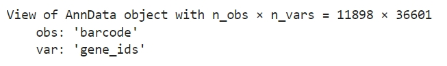

# h5ad file as input
## Read H5AD file as an AnnData object
```python
import scanpy as sc
adata_RNA = sc.read_h5ad('rna.h5ad')
adata_ATAC=sc.read_h5ad('ATAC.h5ad')
import pandas as pd
label=pd.read_csv('label.txt',sep='\t',header=0)
```
```python
adata_RNA
```

<div style="text-align: right">
  
</div>

```python
adata_ATAC
```

<div style="text-align: right">
  
</div>

```python
label
```
<div style="text-align: right">
  
</div>
