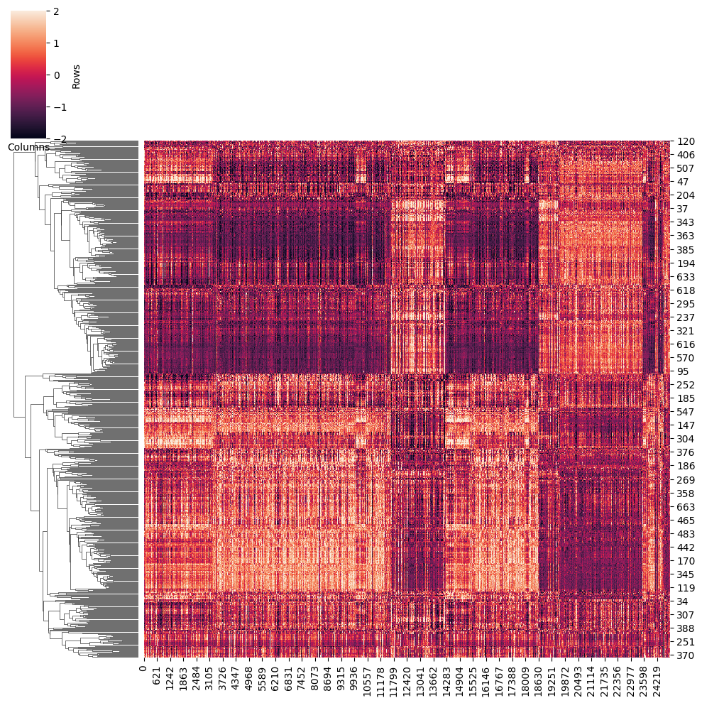
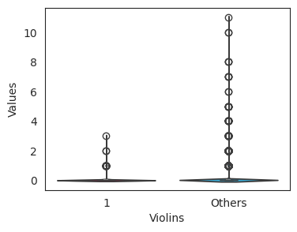

# Other species tutorial
We support for the following species. For other species, we provide another [tutorial](https://github.com/Durenlab/LINGER/blob/main/docs/scNN_newSpecies.md).
|genome_short  | species | species_ensembl | genome |
| --- | --- | --- | --- |
| canFam3 | dog | Canis_lupus_familiaris |CanFam3  | 
| danRer11|zebrafish|Danio_rerio|GRCz11|
|danRer10|zebrafish|Danio_rerio|GRCz10|
| dm6|fly|Drosophila_melanogaster|BDGP6|
| dm3|fly|Drosophila_melanogaster|BDGP5|
| rheMac8|rhesus|Macaca_mulatta|Mmul_8|
|mm10|mouse|Mus_musculus|GRCm38|
|mm9|mouse|Mus_musculus|NCBIM37|
|rn5|rat|Rattus_norvegicus|Rnor_5|
|rn6|rat|Rattus_norvegicus|Rnor_6|
|susScr3|pig|Sus_scrofa|Sscrofa10|
|susScr11|pig|Sus_scrofa|Sscrofa11|
|fr3|fugu|Takifugu_rubripes|FUGU5|
|xenTro9|frog|Xenopus_tropicalis|Xenopus_tropicalis_v9|
|tair10|Arabidopsis|Arabidopsis_thaliana|Tair10|
## Download the provided data 
We provide the TSS location for the above genome and the motif information.
```sh
Datadir=/path/to/LINGER/# the directory to store the data, please use the absolute directory. Example: Datadir=/zfs/durenlab/palmetto/Kaya/SC_NET/code/github/combine/data/
mkdir $Datadir
cd $Datadir
wget --load-cookies /tmp/cookies.txt "https://drive.usercontent.google.com/download?export=download&confirm=$(wget --quiet --save-cookies /tmp/cookies.txt --keep-session-cookies --no-check-certificate 'https://drive.usercontent.google.com/download?id=1Dog5JTS_SNIoa5aohgZmOWXrTUuAKHXV'  -O- | sed -rn 's/.*confirm=([0-9A-Za-z_]+).*/\1\n/p')&id=1Dog5JTS_SNIoa5aohgZmOWXrTUuAKHXV" -O provide_data.tar.gz && rm -rf /tmp/cookies.txt
```
Then unzip，
```sh
tar -xzf provide_data.tar.gz
```
## Prepare the input data
We take the sc data of mm10 as an example. The data is from the published paper (FOXA2 drives lineage plasticity and KIT pathway
activation in neuroendocrine prostate cancer).
The input data is the feature matrix from 10x sc-multiome data and Cell annotation/cell type label which includes: 
- Single-cell multiome data including matrix.mtx, features.tsv/features.txt, and barcodes.tsv/barcodes.txt
- Cell annotation/cell type label if you need the cell type-specific gene regulatory network (label.txt in our example).
<div style="text-align: right">
  
</div>  

If the input data is 10X h5 file or h5ad file from scanpy, please follow the instruction [h5/h5ad file as input](https://github.com/Durenlab/LINGER/blob/main/docs/h5_input.md) .

### sc data
We download the data using the shell command line.
```sh
mkdir -p data
cd data
wget --load-cookies /tmp/cookies.txt "https://drive.usercontent.google.com/download?export=download&confirm=$(wget --quiet --save-cookies /tmp/cookies.txt --keep-session-cookies --no-check-certificate 'https://drive.usercontent.google.com/download?id=1PDOmtO2oL-YVxKQY26jL91SAFedDALA0'  -O- | sed -rn 's/.*confirm=([0-9A-Za-z_]+).*/\1\n/p')&id=1PDOmtO2oL-YVxKQY26jL91SAFedDALA0" -O mm10_data.tar.gz && rm -rf /tmp/cookies.txt
tar -xzvf mm10_data.tar.gz
mv mm10_data/* ./
cd ../
```
We provide the cell annotation as follows:
```sh
wget --load-cookies /tmp/cookies.txt "https://docs.google.com/uc?export=download&confirm=$(wget --quiet --save-cookies /tmp/cookies.txt --keep-session-cookies --no-check-certificate 'https://docs.google.com/uc?export=download&id=1nFm5shjcDuDYhA8YGzAnYoYVQ_29_Yj4' -O- | sed -rn 's/.*confirm=([0-9A-Za-z_]+).*/\1\n/p')&id=1nFm5shjcDuDYhA8YGzAnYoYVQ_29_Yj4" -O mm10_label.txt && rm -rf /tmp/cookies.txt
mv mm10_label.txt data/
```
## LINGER 
### Install
```sh
conda create -n LINGER python==3.10.0
conda activate LINGER
pip install LingerGRN==1.97
conda install bioconda::bedtools #Requirement
```
### Install homer
Check whether homer is installed
```sh
which homer # run this in the command line
```
If homer is not installed, use Conda to install it
```sh
conda install bioconda::homer
```
#### install genome
You can check the installed genome
```sh
dir=$(which homer)
dir_path=$(dirname "$dir")
ls $dir_path/../share/homer/data/genomes/  # this is the installed genomes, if no genome is installed, there will be an error 'No such file or directory'
```
If the genome is not installed, use the following shell script to install it.
```sh
genome='mm10'
perl $dir_path/../share/homer/configureHomer.pl -install $genome
```
For the following step, we run the code in python.
#### Transfer the sc-multiome data to anndata  
We will transfer sc-multiome data to the anndata format and filter the cell barcode by the cell type label.
```python
import scanpy as sc
#set some figure parameters for nice display inside jupyternotebooks.
%matplotlib inline
sc.settings.set_figure_params(dpi=80, frameon=False, figsize=(5, 5), facecolor='white')
sc.settings.verbosity = 3  # verbosity: errors (0), warnings (1), info (2), hints (3)
sc.logging.print_header()
#results_file = "scRNA/pbmc10k.h5ad"
import scipy
import pandas as pd
matrix=scipy.io.mmread('data/matrix.mtx')
features=pd.read_csv('data/features.txt',sep='\t',header=None)
barcodes=pd.read_csv('data/barcodes.txt',sep='\t',header=None)
label=pd.read_csv('data/mm10_label.txt',sep='\t',header=0)
from LingerGRN.preprocess import *
adata_RNA,adata_ATAC=get_adata(matrix,features,barcodes,label)# adata_RNA and adata_ATAC are scRNA and scATAC
```
#### Remove low counts cells and genes
```python
import scanpy as sc
sc.pp.filter_cells(adata_RNA, min_genes=200)
sc.pp.filter_genes(adata_RNA, min_cells=3)
sc.pp.filter_cells(adata_ATAC, min_genes=200)
sc.pp.filter_genes(adata_ATAC, min_cells=3)
selected_barcode=list(set(adata_RNA.obs['barcode'].values)&set(adata_ATAC.obs['barcode'].values))
barcode_idx=pd.DataFrame(range(adata_RNA.shape[0]), index=adata_RNA.obs['barcode'].values)
adata_RNA = adata_RNA[barcode_idx.loc[selected_barcode][0]]
barcode_idx=pd.DataFrame(range(adata_ATAC.shape[0]), index=adata_ATAC.obs['barcode'].values)
adata_ATAC = adata_ATAC[barcode_idx.loc[selected_barcode][0]]
```
#### Generate the pseudo-bulk/metacell:
```python
from LingerGRN.pseudo_bulk import *
samplelist=list(set(adata_ATAC.obs['sample'].values)) # sample is generated from cell barcode 
tempsample=samplelist[0]
TG_pseudobulk=pd.DataFrame([])
RE_pseudobulk=pd.DataFrame([])
singlepseudobulk = (adata_RNA.obs['sample'].unique().shape[0]*adata_RNA.obs['sample'].unique().shape[0]>100)
for tempsample in samplelist:
    adata_RNAtemp=adata_RNA[adata_RNA.obs['sample']==tempsample]
    adata_ATACtemp=adata_ATAC[adata_ATAC.obs['sample']==tempsample]
    TG_pseudobulk_temp,RE_pseudobulk_temp=pseudo_bulk(adata_RNAtemp,adata_ATACtemp,singlepseudobulk)                
    TG_pseudobulk=pd.concat([TG_pseudobulk, TG_pseudobulk_temp], axis=1)
    RE_pseudobulk=pd.concat([RE_pseudobulk, RE_pseudobulk_temp], axis=1)
    RE_pseudobulk[RE_pseudobulk > 100] = 100

import os
if not os.path.exists('data/'):
    os.mkdir('data/')
adata_ATAC.write('data/adata_ATAC.h5ad')
adata_RNA.write('data/adata_RNA.h5ad')
TG_pseudobulk=TG_pseudobulk.fillna(0)
RE_pseudobulk=RE_pseudobulk.fillna(0)
pd.DataFrame(adata_ATAC.var['gene_ids']).to_csv('data/Peaks.txt',header=None,index=None)
TG_pseudobulk.to_csv('data/TG_pseudobulk.tsv')
RE_pseudobulk.to_csv('data/RE_pseudobulk.tsv')
```
### Training model
Overlap the region with general GRN:
```python
Datadir='/path/to/LINGER/'# This directory should be the same as Datadir defined in the above 'Download the general gene regulatory network' section
GRNdir=Datadir+'provide_data/'
genome='mm10'
outdir='/path/to/output/' #output dir
activef='ReLU' 
method='scNN'
import torch
import subprocess
import os
import LingerGRN.LINGER_tr as LINGER_tr
LINGER_tr.get_TSS(GRNdir,genome,200000) # Here, 200000 represent the largest distance of regulatory element to the TG. Other distance is supported
LINGER_tr.RE_TG_dis(outdir)
```
Train for the LINGER model.
```python
import LingerGRN.LINGER_tr as LINGER_tr
activef='ReLU' # active function chose from 'ReLU','sigmoid','tanh'
genomemap=pd.read_csv(GRNdir+'genome_map_homer.txt',sep='\t')
genomemap.index=genomemap['genome_short']
species=genomemap.loc[genome]['species_ensembl']
LINGER_tr.training(GRNdir,method,outdir,activef,species)
```
### Cell population gene regulatory network
#### TF binding potential
The output is 'cell_population_TF_RE_binding.txt', a matrix of the TF-RE binding score.
```python
import LingerGRN.LL_net as LL_net
LL_net.TF_RE_binding(GRNdir,adata_RNA,adata_ATAC,genome,method,outdir)
```

#### *cis*-regulatory network
The output is 'cell_population_cis_regulatory.txt' with 3 columns: region, target gene, cis-regulatory score.
```python
LL_net.cis_reg(GRNdir,adata_RNA,adata_ATAC,genome,method,outdir)
```
#### *trans*-regulatory network
The output is 'cell_population_trans_regulatory.txt', a matrix of the trans-regulatory score.
```python
LL_net.trans_reg(GRNdir,method,outdir,genome)
```

### Cell type sepecific gene regulaory network
There are 2 options:
1. infer GRN for a specific cell type, which is in the label.txt;
```python
celltype='1' #use a string to assign your cell type
```
2. infer GRNs for all cell types.
```python
celltype='all'
```
Please make sure that 'all' is not a cell type in your data.
#### Motif matching
```python
command='paste data/Peaks.bed data/Peaks.txt > data/region.txt'
subprocess.run(command, shell=True)
import pandas as pd
genome_map=pd.read_csv(GRNdir+'genome_map_homer.txt',sep='\t',header=0)
genome_map.index=genome_map['genome_short']
command='findMotifsGenome.pl data/region.txt '+genome+' ./. -size given -find '+GRNdir+'all_motif_rmdup_'+genome_map.loc[genome]['Motif']+'> '+outdir+'MotifTarget.bed'
subprocess.run(command, shell=True)
```
#### TF binding potential
The output is 'cell_population_TF_RE_binding_*celltype*.txt', a matrix of the TF-RE binding potential.
```python
LL_net.cell_type_specific_TF_RE_binding(GRNdir,adata_RNA,adata_ATAC,genome,celltype,outdir,method)# different from the previous version
```

#### *cis*-regulatory network
The output is 'cell_type_specific_cis_regulatory_{*celltype*}.txt' with 3 columns: region, target gene, cis-regulatory score.
```python
LL_net.cell_type_specific_cis_reg(GRNdir,adata_RNA,adata_ATAC,genome,celltype,outdir,method)
```

#### *trans*-regulatory network
The output is 'cell_type_specific_trans_regulatory_{*celltype*}.txt', a matrix of the trans-regulatory score.
```python
LL_net.cell_type_specific_trans_reg(GRNdir,adata_RNA,celltype,outdir)
```
## Identify driver regulators by TF activity
### Instruction
TF activity, focusing on the DNA-binding component of TF proteins in the nucleus, is a more reliable metric than mRNA or whole protein expression for identifying driver regulators. Here, we employed LINGER inferred GRNs from sc-multiome data of a single individual. Assuming the GRN structure is consistent across individuals, we estimated TF activity using gene expression data alone. By comparing TF activity between cases and controls, we identified driver regulators. 

### Prepare
We need to *trans*-regulatory network, you can choose a network match you data best.
1. If your gene expression data are matched with cell population GRN, you can set
```python
network = 'cell population'
```
2. If your gene expression data are matched with certain cell type, you can set network to the name of this cell type.
```python
network = 'CD56 (bright) NK cells' # CD56 (bright) NK cells is the name of one cell type
```

### Calculate TF activity
The input is gene expression data, It could be the scRNA-seq data from the sc multiome data. It could be other sc or bulk RNA-seq data matches the GRN. The row of gene expresion data is gene, columns is sample and the value is read count (sc) or FPKM/RPKM (bulk).

```python
from LingerGRN.TF_activity import *
TF_activity=regulon(outdir,adata_RNA,GRNdir,network,genome)
```
Visualize the TF activity heatmap by cluster. If you want to save the heatmap to outdit, please set 'save=True'. The output is 'heatmap_activity.png'.
```python
save=True
heatmap_cluster(TF_activity,adata_RNA,save,outdir)
```
<div style="text-align: right">
  
</div>

### Identify driver regulator
We use t-test to find the differential TFs of a certain cell type by the activity. 
1. You can assign a certain cell type of the gene expression data by
```python
celltype='1'
```
2. Or, you can obtain the result for all cell types.
```python
celltype='all'
```

For example,

```python
celltype='1'
t_test_results=master_regulator(TF_activity,adata_RNA,celltype)
t_test_results
```

<div style="text-align: right">
  
</div>

Visulize the differential activity and expression. You can compare 2 different cell types and one cell type with other cell types. If you want to save the heatmap to outdit, please set 'save=True'. The output is 'box_plot'_+TFName+'_'+datatype+'_'+celltype1+'_'+celltype2+'.png'.

```python
TFName='Erg'
datatype='activity'
celltype1='1'
celltype2='Others'
save=True
box_comp(TFName,adata_RNA,celltype1,celltype2,datatype,TF_activity,save,outdir)
```

<div style="text-align: right">
  
</div>

For gene expression data, the boxplot is:
```python
datatype='expression'
box_comp(TFName,adata_RNA,celltype1,celltype2,datatype,TF_activity,save,outdir)
```

<div style="text-align: right">
  
</div>


