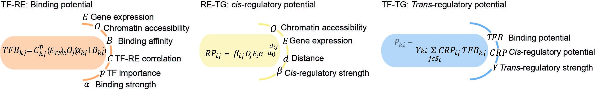

# Construct the gene regulatory netwok by intergrating the general network (no training)
## Instruction
This tutorial delineates an approach for constructing cell type-specific gene regulatory networks from single-cell data using feature engineering methodology. Rather than directly training models on the single cell data, this workflow offers a rapid approach.

Just as the following figure, we combine the single cell data ($O, E$, and $C$ in the figure) and the prior gene regulatory network structure with the parameter $\alpha,\beta,d,B$, and $\gamma$.

In this tutorial, we will 1. load the data we provide, 2. preprocess, 3. prepare the input data. 4. generate the cell population level gene regulatory network, 5. generate the cell type specific gene regulatory network.
## Download the the general gene regulatory network 
We provide the generan gene regulatory network
```
LINGERdir=/path/to/LINGER/
cd $LINGERdir
wget --load-cookies /tmp/cookies.txt "https://docs.google.com/uc?export=download&confirm=$(wget --quiet --save-cookies /tmp/cookies.txt --keep-session-cookies --no-check-certificate 'https://docs.google.com/uc?export=download&id=1vM8btN3LWu699YiPH0JyjIV_LZBIxiX_' -O- | sed -rn 's/.*confirm=([0-9A-Za-z_]+).*/\1\n/p')&id=1vM8btN3LWu699YiPH0JyjIV_LZBIxiX_" -O data_bulk.tar.gz && rm -rf /tmp/cookies.txt
```
Then unzip，
```sh
tar -xzf data_bulk.tar.gz
```
## Prepare the input data
The input is 
- Single-cell multiome data including gene expression (RNA.txt in our example) and chromatin accessibility (ATAC.txt in our example).
- Cell annotation/cell type label if you need the cell type specific gene regulatory network (label.txt in our example).
### RNA-seq
The row of RNA-seq is gene symbol; the column is barcode; the value is the count matrix. Here is our example:

### ATAC-seq
The row is regulatory element/genomic region; the column is barcode, which is the same order with RNA-seq data; the value is the count matrix. Here is our example:

### Cell annotation/cell type label
The row is cell barcode, which is the same order with RNA-seq data; there is one column 'Annotation', which is the cell type label. It could be a number or the string. Here is our example:

## Gene regulatory network inference
### Preprocess
Map the regions to the given regions by running the following code in linux. The output is overlaped region in each chromtin (Region_overlap_chr*.bed) in the same directory of input data.
```sh
Inputdir=/path/to/dir/ # all the input file should be in this directory
genome=hg38 # only hg38 and hg19 supported
cd $Inputdir
cat ATAC.txt|cut -f 1 |sed '1d' |sed 's/:/\t/g'| sed 's/-/\t/g' > Region.bed
GRNdir=$LINGERdir/data_bulk
$LINGERdir/extract_overlap_regions.sh "$GRNdir" $genome
cd $LINGERdir
```
### Load the input data.
We load the input data and import the function. The following sections are in python.
```python
import LL_net
Inputdir='/zfs/durenlab/palmetto/Kaya/SC_NET/code/github/version1/Input/'
GRNdir='/zfs/durenlab/palmetto/Kaya/SC_NET/code/github/version1/data_bulk/'
RNA_file='RNA.txt'
labels='label.txt'
ATAC_file='ATAC.txt'
genome='hg38'
```
### cell population gene regulatory network
#### TF binding potential
The output is 'cell_population_TF_RE_binding.txt', a matrix of the TF-RE binding potential.
```python
result=LL_net.TF_RE_binding(Inputdir,GRNdir,RNA_file,ATAC_file,genome)
```
#### *cis*-regulatory network

#### *trans*-regulatory network