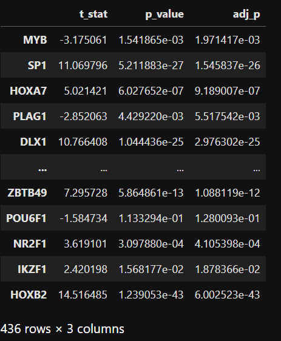

# Identify driver regulators by TF activity
## Instruction
TF activity, focusing on the DNA-binding component of TF proteins in the nucleus, is a more reliable metric than mRNA or whole protein expression for identifying driver regulators. Here, we employed LINGER inferred GRNs from sc-multiome data of a single individual. Assuming the GRN structure is consistent across individuals, we estimated TF activity using gene expression data alone. By comparing TF activity between cases and controls, we identified driver regulators. 

## Prepare
We need to *trans*-regulatory network, you can choose a network match you data best.
1. If there is not single cell avaliable to infer the cell population and cell type specific GRN, you can choose a GRN from various tissues.
```python
network = 'general'
```
2. If your gene expression data are matched with cell population GRN, you can set
```python
network = 'cell population'
```
3. If your gene expression data are matched with certain cell type, you can set network to the name of this cell type.
```python
network = '0' # 0 is the name of one cell type
```
## Calculate TF activity
```python
Input_dir='/zfs/durenlab/palmetto/Kaya/SC_NET/code/github/combine/Input/'
RNA_file='RNA.txt'
GRNdir='/zfs/durenlab/palmetto/Kaya/SC_NET/code/github/combine/data_bulk/'
genome='hg38'
from TF_activity import *
regulon_score=regulon(Input_dir,RNA_file,GRNdir,network,genome)
```
## Identify driver regulator
We use t-test to find the differential TFs of a certain cell type by the activity. 
1. You can assign a certain cell type by
```python
celltype='0'
```
2. Or, you can obtain the result for all cell types.
```python
celltype='all'
```
```python
labels='label.txt'
t_test_results=master_regulator(regulon_score,Input_dir,labels,celltype)
t_test_results
```
<div style="text-align: right">
  
</div>
